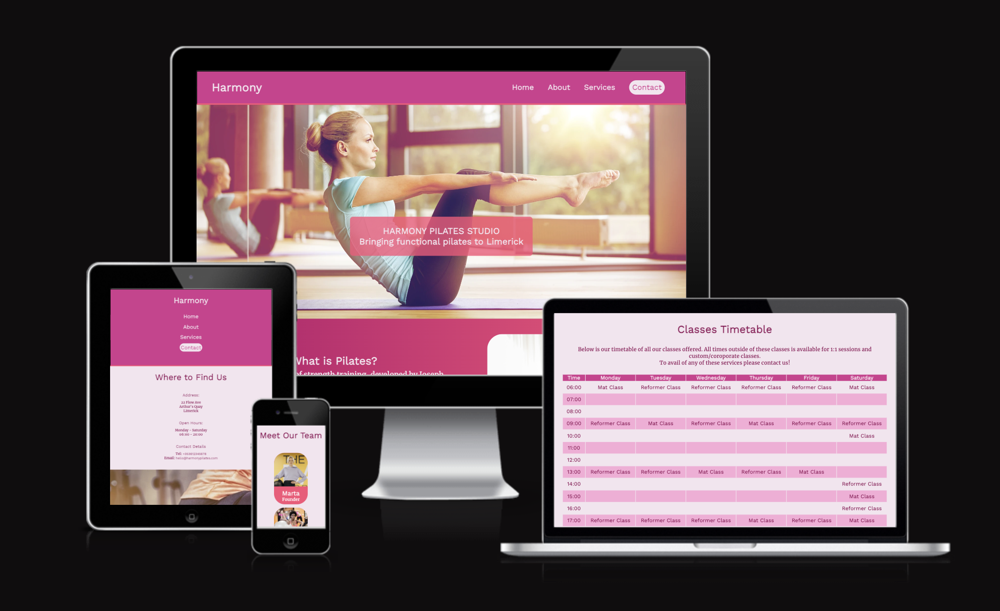
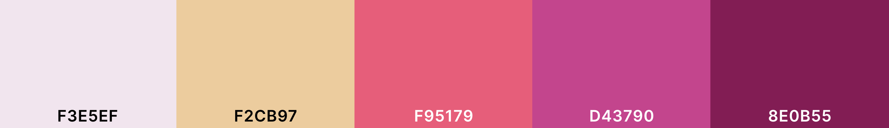
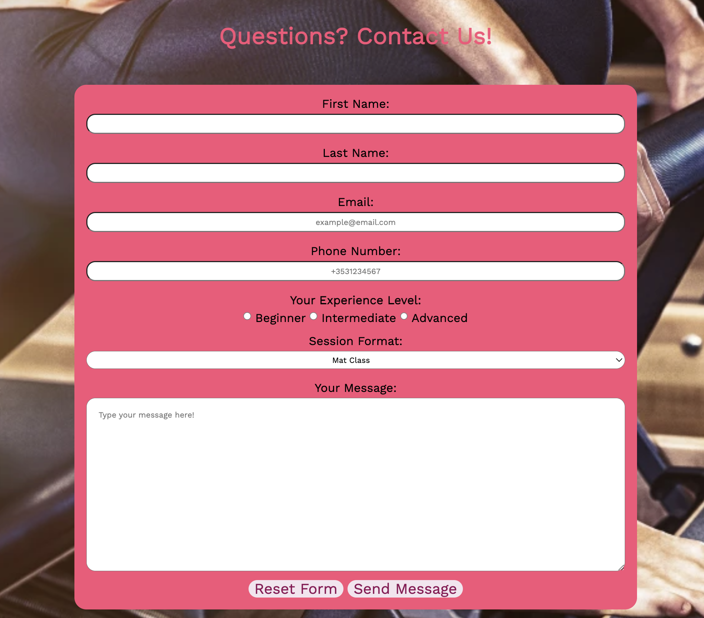

# Harmony Pilates

[Live project can be viewed here](https://saziosu.github.io/harmony-pilates/)

A site for a pilates studio based in Limerick, Ireland. The site is aimed at providing information and contact details for users that are interesting in attending pilates sessions.

---

# Table of Contents
xxxxxxxxxx
---

# User Experience

The goal of the site is to be brightly colored and eyecatching, while remaining accessible and easy to navigate.
 
The hover effects on the nav bar and footer give feedback to the user. 
 
The links for all pages are included in the footer, so that the user is not required to scroll all the way to the top of the page to navigate through the rest of the site.
 
There are also links within the site's sections, to encourage the user to look at the services offered and contact the studio to sign up.

## User Stories

* First Time User
    * As a first time user, we want to easily navigate through the website and intuitively know where to learn about the services offered by the pilates studio.
    * As a first time user, we like to know more about who is running the studio and who we can expect to train with in future.
    * As a first time user, we want to know where the studio is located to know if it is in our range of travel.
    * As a first time user, we want to be able to easily contact the studio to ask questions and sign up.
* Returning User
    * As a returning user, we want to ensure that the timetable matches up with our own schedules so that we can plan accordingly.
    * As a returning user, we want to ensure that we have the correct contact details and location information for us to access the pilates studio.
* Frequent User
    * As a frequent user, we want to keep up to date with the times of all the classes that we plan to attend.
    * As a frequent user, we want to be aware of any changes in pricing or opening hours.

## Wireframes

 Balsamiq was used to create the wireframes for desktop, tablet and mobile.

### Home

Wireframes for homepage

Click to Expand

### About

Wireframes for about page 

### Services

Wireframes for services page 

### Contact

Wireframes for contact page

# Design 

## Color Scheme
Shades of pink were chosen to invoke a playful and energetic response in the user.
Fonts were set as the darker `#8E0B55` Claret color to ensure there was enough constract to allow for accessibility.
Hover effects in the navigation bar and footer were set to the `#F2CB97` Sunset color to give responsive feedback to the user.

The text on the team section under the About page was changed to white, to ensure enough contrast for accessibility.

## Typography

[FontPair](https://www.fontpair.co/pairings/work-sans-merriweather) was used to generate a matching set of fonts from GoogleFonts.

* Work Sans was used for the headings.

* Merriweather was used for the paragraphs.

* San-serif was the fallback font used for both imported fonts.

## Imagery

Images were downloaded from [Pexels](https://www.pexels.com/) and [ShutterStock](https://www.shutterstock.com/)
 
Further information is present in the credits section.

# Features

## Existing Features

### **Navigation Bar**
* The navigation bar is responsive across all devices. It is consistent across all four pages on this website. The navigation bar includes responsive links with a sunset colored hover effect to provide feedback to the user as they move across each navigation link.
* The navigation bar features a button styled link for contact to highlight to the user where they can easily contact the studio.
* The navigation bar also features a bottom border with the `#F95179` Bright Pink color to give some constrast at between the navigation bar and following sections.
* The user can also click on the logo to bring them back to the homepage.
    

### **Homepage**

* **Landing Page**

    * The hero page features a woman practicing pilates along with a mission statement overlayed on it. This details to the user what the purpose of the site is; to highlight a pilates studio that provides functional Pilates along with the location. This indicates to the user where the studio is located so they are immediately aware of the area it is based, and subsequently know if that studio is somewhere they would like to attend.
    * The image also grabs the attention of the user, and the color of the image was chosen to match the colors of the rest of the site to give a cohesive effect with the nav bar and following sections.

    

* **Homepage Information Sections**

    * There are two sections on the homepage featuring information about pilates. It details what Pilates is and the benefits of practicing it. This encourages the user to undestand how they may benefit from praciting Pilates and understand if its the right choice for them.
    * The benefits section also features a link to the contact page, to invite the user to reach out to the studio.

    

    

### About Page

* **Studio Section**
    * This section provides some background about the pilates studio. It aims to give some history on when the studio was set up, to show the user that the studio provides a premium exeperience and shows some of the benefits of choosing this studio specifically.

    

* **Our Team Section**
    * The team section showcases the founder and instructors providing the service to the user. 
    * The profile cards grabs the eye and show cases the photo, name and role of each person. They give the user some details on who they can expect to interact with if they attend the studio. 

### Services Page

* **Our Services Section**
    * This section shows the user that they can have a fully customizable experience if they choose to practice pilates at the studio. 
    * The section also showcases the different forms of pilates, using Mat and Reformer. This allows the user to understand which option may be best for them, based on their own individual capabilities and requirements.

    
    

* **Pricing Section**
    * The pricing section gives transparency to the user on what they can expect to pay for each service.
    * This section also showcases some introductory offers, to encourage the user to sign up for a lower priced package.

    

* **Timetable Section** 
    * The timetable shows the times of all pilates classes throughout the available hours in the week.
    * This timetable allows the user to keep up to date on when their desired class or session will be occurring. This allows them to plan accordingly and choose a time that works for them.
    * On smaller screens, this features a sticky column for the times, to allow the user to scroll effectively and see the correct times.

 
    

   
    

### Contact Page

 * **Contact Details**
    * This section shows the address, to provide the specific location of the studio. This shows the user where they would be attending when they sign up.
    * This section shows the opening hours, to give the user specific information on the opening hours so they know when they can attend and when they can contact to sign up.
    * This section also provides the phone number and email address to contact the studio. The phone number and email also include tel and mailto links respectively, this makes it easier for the user to call or email the studio.
    
    

* **Contact Form** 
    * The contact form features a background image of studio members using the reformer machine, this gives a cohesive look to the form so that the user is reminded of what they may be enquiring about. 
    * The contact form has the different elements set to required. The email and phone number elements require valid email addresses and phone numbers respectively. The text area requires a minimum of 25 characters. This is set to help prevent contact form spam attacks. 
    * The experience level and session format inputs give the studio some more background on the user's individual requirements and experience levels to allow them to format an appropriate response to follow up with the user when they submit the form.
    * The form is set in a bright pink div, to catch the eye and encourage the user to fill in their enquiry.

    

### **Footer**

* The footer provides links to the other pages on the site, this helps the flow of the page so the user does not have to scroll all the way back up to the navigation bar to move around the other pages.
* The footer features links to social media, such as Facebook, YouTube and Twitter. This gives the user the option to keep up to date with the daily posts, and videos that may be posted by the studio and become a part of the social community. These links also use fontawesome icons to indicate which social media platform they are linking to.
* The page and social links also have a hover feature to give feedback to the user.

## Future Features

* Online booking system when I have increased my skillset, would be helpful in making signing up easier for both the user and the administrator of the studio.
* Custom error pages, such as a 404 would give a more cohesive look and allow the user to continue navigating the site.
* Internal pages with videos and instructions for at-home workouts would give the user some further encouragement to practice piltates.
* Membership login backend could be implemented with some internal pages to allow users to track their progress

## Accessibility

* Semantic HTML was used throughout the site to ensure accessability
* Links to external resources and other pages in the footer were given `aria-label` attributes to ensure those using screenreaders are aware of their purpose and action

# Technology Used

## Languages

* HTML
* CSS

## Frameworks, Libraries & Programs 

* [Balsamiq](https://balsamiq.com/wireframes/) was used to create the wireframes to plan out the website.
* [Fontpair](https://www.fontpair.co/pairings/work-sans-merriweather) was used to pick complementary fonts
* [FontAwesome](https://fontawesome.com/) was used to pick the social icons
* [Coolers](https://coolors.co/) was used to to pick the color palette
* [Pixlr](https://pixlr.com/) was used for image editing
* [Flexbox](https://developer.mozilla.org/en-US/docs/Web/CSS/CSS_Flexible_Box_Layout) was used to construct a flexible layout and responsive design

# Testing

[TESTING.md](TESTING.md)
