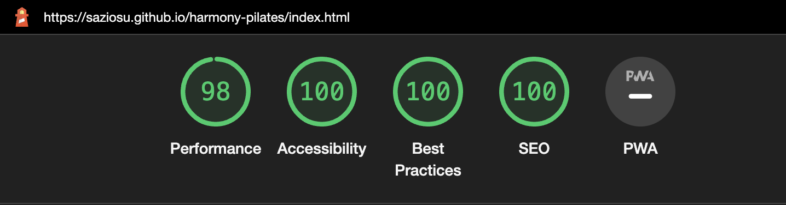
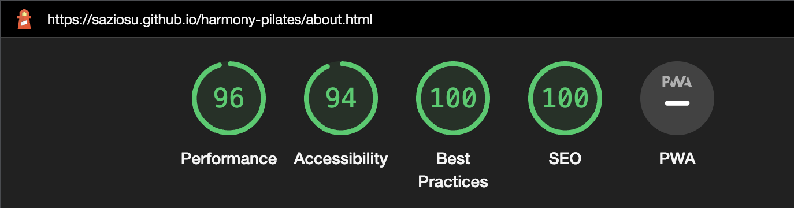
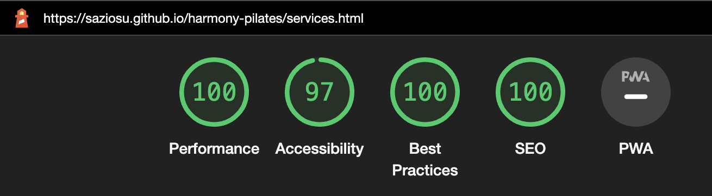
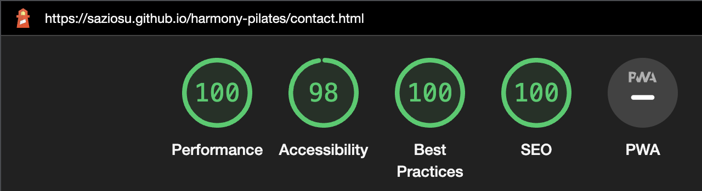
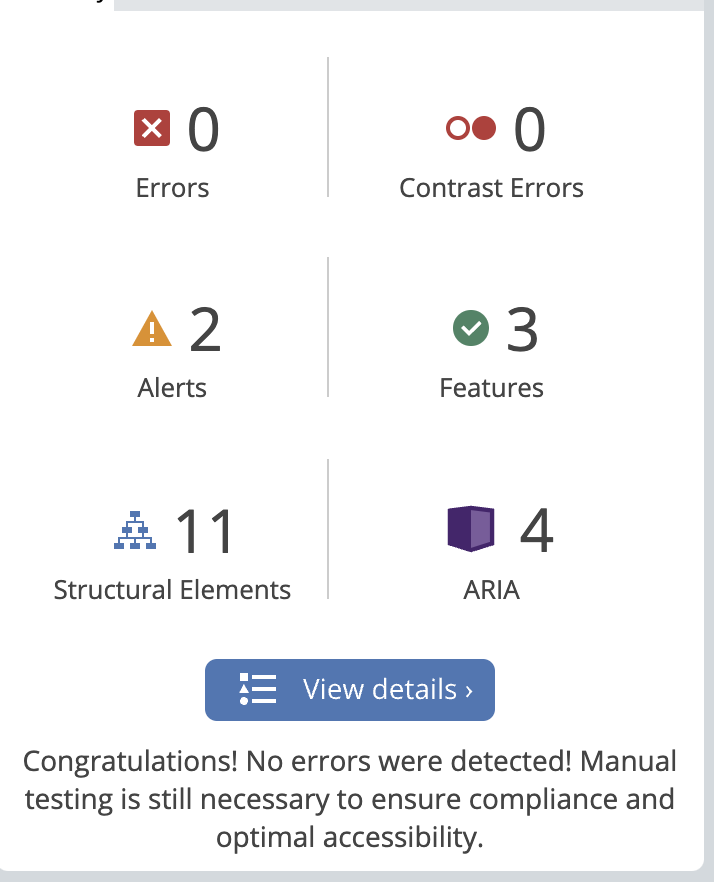
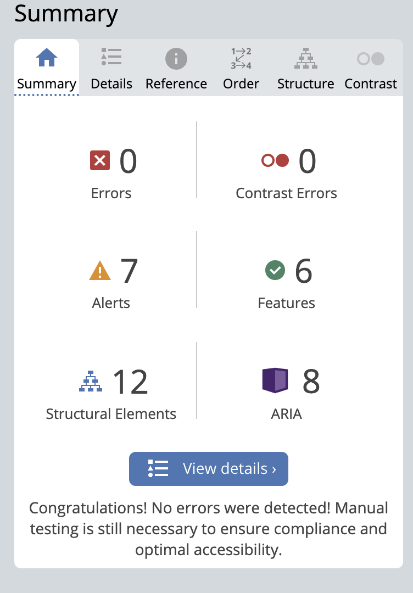
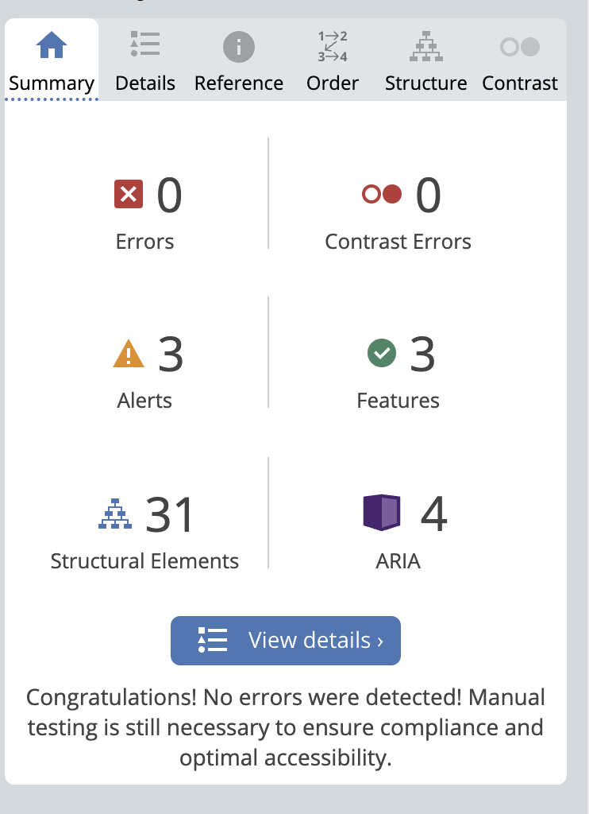
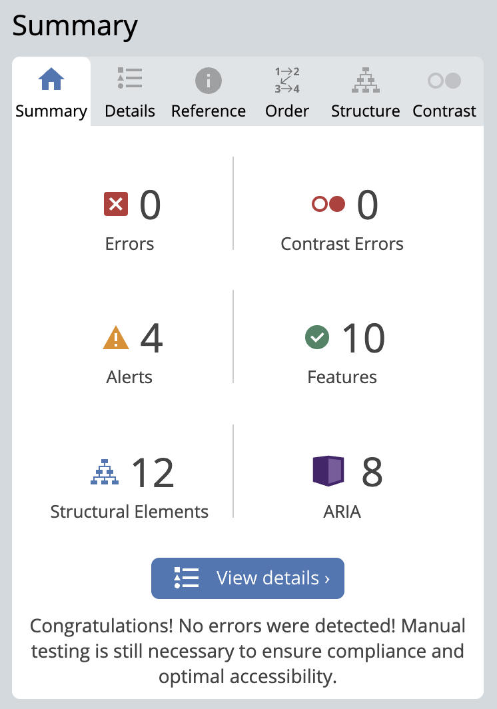

# Harmony Pilates | Testing

Link for the finished deployed site: [Harmony Pilates](https://saziosu.github.io/harmony-pilates/)

# Table of Contents

XXXXXXXXXX

# Automated Testing

## W3C Validator

[W3C](https://validator.w3.org/) was used to validate the HTML code across all pages of the website.
All tests were passed:

* [Index)](https://validator.w3.org/nu/?doc=https%3A%2F%2Fsaziosu.github.io%2Fharmony-pilates%2Findex.html) - passed all checks
* [About](https://validator.w3.org/nu/?doc=https%3A%2F%2Fsaziosu.github.io%2Fharmony-pilates%2Fabout.html) - passed all checks
* [Services](https://validator.w3.org/nu/?doc=https%3A%2F%2Fsaziosu.github.io%2Fharmony-pilates%2Fservices.html) - passed all checks
* [Contact](https://validator.w3.org/nu/?doc=https%3A%2F%2Fsaziosu.github.io%2Fharmony-pilates%2Fcontact.html) - passed all checks

## CSS Validator

[Jigsaw](https://jigsaw.w3.org/css-validator/) was used to validate the CSS code across all pages of the website.

* [Index](https://jigsaw.w3.org/css-validator/validator?uri=https%3A%2F%2Fsaziosu.github.io%2Fharmony-pilates%2Findex.html&profile=css3svg&usermedium=all&warning=1&vextwarning=&lang=en) - passed all checks
* [About](https://jigsaw.w3.org/css-validator/validator?uri=https%3A%2F%2Fsaziosu.github.io%2Fharmony-pilates%2Fabout.html&profile=css3svg&usermedium=all&warning=1&vextwarning=&lang=en) - passed all checks
* [Services](https://jigsaw.w3.org/css-validator/validator?uri=https%3A%2F%2Fsaziosu.github.io%2Fharmony-pilates%2Fservices.html&profile=css3svg&usermedium=all&warning=1&vextwarning=&lang=en) - passed all checks
* [Contact](https://jigsaw.w3.org/css-validator/validator?uri=https%3A%2F%2Fsaziosu.github.io%2Fharmony-pilates%2Fcontact.html&profile=css3svg&usermedium=all&warning=1&vextwarning=&lang=en) - passed all checks

## Lighthouse

Lighthouse, via chrome dev tools, was used to ensure the accessibility is at an acceptable level:

### Homepage

### About

### Services

### Contact

## WAVE

[WAVE](https://wave.webaim.org/) was used to check accessibility

### Home Page

[index.html](https://wave.webaim.org/report#/https://saziosu.github.io/harmony-pilates/index.html)

### About Page

[about.html](https://wave.webaim.org/report#/https://saziosu.github.io/harmony-pilates/about.html)

### Services Page

[services.html](https://wave.webaim.org/report#/https://saziosu.github.io/harmony-pilates/services.html)

### Contact 

[contact.html](https://wave.webaim.org/report#/https://saziosu.github.io/harmony-pilates/contact.html)

# Manual Testing

## User Testing

### First time visitors

| Goal                                                                                                                                                       | Acheived                                                                                                        |
|------------------------------------------------------------------------------------------------------------------------------------------------------------|-----------------------------------------------------------------------------------------------------------------|
| As a first time user, we want to easily navigate through the website and intuitively know where to learn about the services offered by the pilates studio. | The site is responsive across all devices, and includes a bright and colorful navbar with intuitive page links. |
| As a first time user, we like to know more about who is running the studio and who we can expect to train with in future.                                  | The site includes profile cards of the employees at the pilates studio, with their names and roles.             |
| As a first time user, we want to know where the studio is located to know if it is in our range of travel.                                                 | The contact page includes the specific location of the studio.                                                  |
| As a first time user, we want to be able to easily contact the studio to ask questions and sign up.                                                        | The contact page includes email, phone number and a contact form.                                               |

### Returning User

| Goal                                                                                                                                          | Acheived                                                                   |
|-----------------------------------------------------------------------------------------------------------------------------------------------|----------------------------------------------------------------------------|
| As a returning user, we want to ensure that the timetable matches up with our own schedules so that we can plan accordingly.                  | There is a full timetable of classes listed on the services page.          |
| As a returning user, we want to ensure that we have the correct contact details and location information for us to access the pilates studio. | The contact page includes the location and contact details for the studio. |

### Frequent User

| Goal                                                                                                     | Acheived                                                                                                                                                                                 |
|----------------------------------------------------------------------------------------------------------|------------------------------------------------------------------------------------------------------------------------------------------------------------------------------------------|
| As a frequent user, we want to keep up to date with the times of all the classes that we plan to attend. | There is a timetable for the times of any classes. All listings that are not set for a class can be used for 1:1 pilates session.                                                        |
| As a frequent user, we want to be aware of any changes in pricing or opening hours.                      | There is pricing details on the services page, along with contact info on the contact page. There are also social links listed in the footer to keep up with the studio on social media. |

# Full Testing

A wide range of devices were used.

* MAC: MacBook Pro 14-inch 2021 (Mac OS Ventura) (Chrome, Safari, Firefox)

* Android: OnePlus 7T Pro (Chrome, Firefox)

[Browserstack](https://www.browserstack.com/) was also used to test on the following devices:

* Windows: Windows 11 (Chrome, Firefox, Edge)

* iOS: iPhone 14 Pro (Safari, Chrome)

## Home Page:

| Feature        | Expected                                                                         | Tested                            | Result                                | Pass/Fail |
|----------------|----------------------------------------------------------------------------------|-----------------------------------|---------------------------------------|-----------|
| Hovers         | Navbar and Footer links to other pages should display a yellow color on hovering | Hovered over the nav/footer links | Hover links displayed as yellow color | Pass      |
| Links          | Links to external websites should open in a new tab                              | Clicked social links in footer    | Social links open in a new tab        | Pass      |
| Internal links | Links to other pages in the content should redirect to the correct page          | Clicked link in homepage section  | Correct page opened in same tab       | Pass      |
        

## About Page

